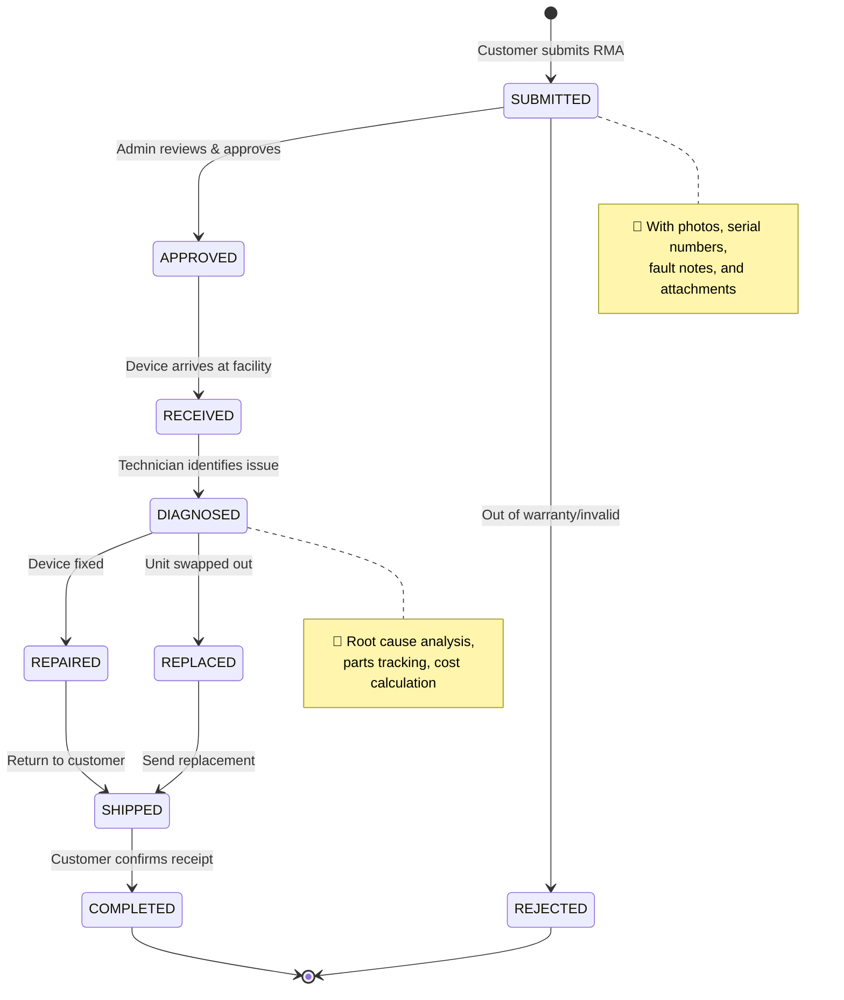
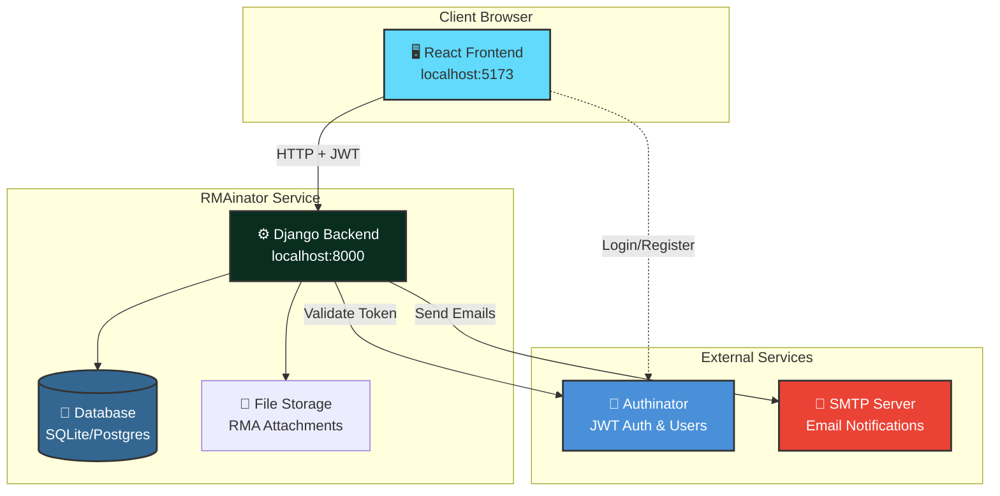
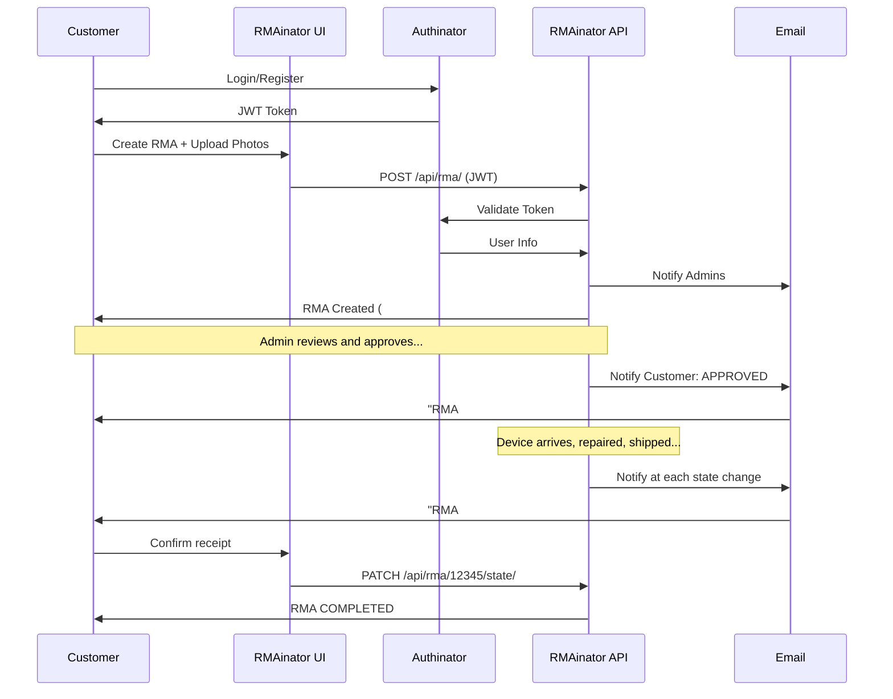
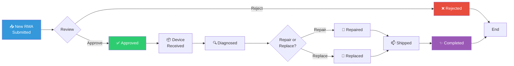

# RMAinator

> *"Behold, the RMA-inator! It tracks every return, repair, and replacement with the efficiency of... well, a really efficient tracking system!"*

**RMAinator** is a complete RMA (Return Merchandise Authorization) tracking system that manages device repair workflows from submission to completion. Part of the [Inator Platform](https://github.com/losomode/inator), it gives admins full control over repair operations while keeping customers informed every step of the way.

[](https://www.djangoproject.com/) [](https://reactjs.org/) [](./backend) [](./backend)

---

## 🎯 What Does It Do?

RMAinator handles the complete lifecycle of device returns:



**For Customers:**
- Submit RMAs with photos and documentation
- Track repair status in real-time
- Receive email notifications at each stage
- View complete repair history

**For Admins:**
- Approve/reject RMA requests
- Track device through repair workflow
- Record technical details (root cause, parts, costs)
- Monitor stale RMAs with configurable timeouts
- Full audit trail of all changes

---

## 🏗️ Architecture

RMAinator is a standalone microservice that delegates authentication to **Authinator**:



**Key Design Decisions:**
- **JWT Authentication**: No local user database, all auth via Authinator
- **Django + DRF**: Robust backend with batteries included
- **React + Vite**: Modern, fast frontend development
- **Email Notifications**: Automatic updates at each workflow stage
- **File Attachments**: S3-compatible storage for photos and documents
- **Audit Logging**: Complete field-level change tracking

---

## 🚀 Quick Start

### Prerequisites

- Python 3.11+
- Node.js 18+
- [Task](https://taskfile.dev/) - `brew install go-task`
- Access to Authinator (for JWT validation)

### Platform Mode (Recommended)

If you're using the [Inator Platform](https://github.com/losomode/inator):

```bash
# From the platform root (inator/)
task setup           # Sets up all inators including RMAinator
task start:all       # Starts all services + unified frontend + gateway

# Access at http://localhost:8080
```

### Standalone Mode

```bash
# Clone the repo
git clone git@github.com:losomode/RMAinator.git
cd RMAinator

# Install everything (backend + frontend)
task install

# Configure Authinator connection
cp backend/.env.example backend/.env
# Edit backend/.env with your AUTHINATOR_API_URL and settings

# Run migrations
task backend:migrate
```

### Development

```bash
# Terminal 1: Start backend (port 8002)
task backend:dev

# Terminal 2: Start frontend (port 3002, standalone only)
task frontend:dev
```

**Access:**
- Frontend (standalone): http://localhost:3002
- Frontend (platform): http://localhost:8080
- Backend API: http://localhost:8002
- Django Admin: http://localhost:8002/admin

**Note**: When running via the Inator Platform, the frontend is served from the unified SPA at `inator/frontend/`. The standalone frontend is only for isolated development.

### Troubleshooting Fresh Installs

If services fail to start, check:

```bash
# Verify .env exists
ls -la backend/.env

# Run migrations if database doesn't exist
task backend:migrate

# Check that dependencies installed correctly
ls -la .venv/                    # Backend venv should exist
ls -la frontend/node_modules/    # Frontend deps should exist

# View logs if running via platform orchestrator
tail -50 /path/to/logs/RMAinator-backend.log
tail -50 /path/to/logs/RMAinator-frontend.log
```

### Production Deployment

```bash
# Build production assets
task build

# Run database migrations
task backend:migrate

# Collect static files
task backend:collectstatic

# Run with gunicorn (example)
gunicorn config.wsgi:application --bind 0.0.0.0:8000
```

See [Deployment](#-deployment) section for full production setup.

---

## 📋 Available Tasks

```bash
task --list                   # Show all available commands

# Development
task dev                      # Show dev server instructions
task backend:dev              # Run Django dev server
task frontend:dev             # Run Vite dev server

# Testing & Quality
task test                     # Run all tests
task test:coverage            # Run tests with coverage (must be ≥85%)
task check                    # Pre-commit checks (lint, fmt, test)

# Database
task backend:migrate          # Run migrations
task backend:makemigrations   # Create migrations
task backend:shell            # Django shell
task db:reset                 # Reset database (⚠️ destructive)

# Utilities
task backend:check-stale      # Check for stale RMAs
task build                    # Build for production
task clean                    # Clean build artifacts
```

---

## 🔄 The RMA Workflow

### Customer Journey



### Admin Workflow



**Admin Actions at Each Stage:**
1. **SUBMITTED** → Review RMA details, approve or reject with reason
2. **APPROVED** → Mark as RECEIVED when device arrives
3. **RECEIVED** → Diagnose issue, add technical notes
4. **DIAGNOSED** → Record root cause, required parts, estimated cost
5. **REPAIRED/REPLACED** → Document work performed, actual costs
6. **SHIPPED** → Add tracking number, return date
7. **COMPLETED** → Archive RMA, calculate time-in-state metrics

---

## 🎯 Features

### 👤 Customer Features

- 🔐 **Secure Authentication** - Via Authinator (SSO, 2FA, WebAuthn supported)
- 📦 **Multi-Device Submissions** - Group multiple devices in one RMA
- 📎 **File Attachments** - Upload photos, PDFs, diagnostic reports
- 📊 **Real-Time Tracking** - See current status and complete history
- 🔔 **Email Notifications** - Automatic updates at each workflow stage
- 📜 **Audit History** - View every change made to your RMA
- 🔍 **Search & Filter** - Find RMAs by serial number, date, status
- 🎨 **Unified UI** - Integrated into the platform's single-page React app

### 👨‍💼 Admin Features

- 🏛️ **Complete RMA Management** - Search, filter, bulk actions
- 🔄 **State Management** - Transition RMAs through defined workflow
- 📈 **Admin Dashboard** - Metrics, trends, recent activity at a glance
- ⚠️ **Stale RMA Detection** - Configurable timeout alerts by state/priority
- 🔍 **Advanced Search** - Filter by RMA#, serial, owner, state, priority, dates
- 📝 **Technical Fields** - Root cause, parts, costs, diagnostic details
- 📧 **Admin Notifications** - Alerts for new RMAs and stale items
- 🕐 **Complete Audit Trail** - Field-level change history
- 🔐 **Role-Based Access** - Permissions via Authinator JWT tokens
- 📊 **Reporting** - Export capabilities, analytics

---

## 🗂️ Project Structure

```
RMAinator/
├── backend/                          # Django application
│   ├── config/                       # Settings, URLs, WSGI
│   │   ├── settings.py               # Environment-based config
│   │   └── urls.py                   # API routing
│   ├── core/                         # Shared functionality
│   │   ├── authentication.py         # Authinator JWT validation
│   │   ├── authinator_client.py      # Authinator API client
│   │   ├── permissions.py            # Role-based permissions
│   │   ├── test_authentication.py    # Auth tests (100% coverage)
│   │   └── test_utils.py             # Test helpers
│   ├── rma/                          # RMA domain logic
│   │   ├── models.py                 # RMA, RMAGroup, state history
│   │   ├── views.py                  # REST API endpoints
│   │   ├── serializers.py            # DRF serializers
│   │   ├── dashboard.py              # Admin metrics
│   │   ├── signals.py                # Email triggers
│   │   ├── test_models.py            # Model tests (95%)
│   │   ├── test_views.py             # API tests (99%)
│   │   └── test_dashboard.py         # Dashboard tests (98%)
│   ├── notifications/                # Email & alerts
│   │   ├── models.py                 # StateTimeout, StaleRMARecord
│   │   ├── utils.py                  # Email utilities
│   │   ├── tests.py                  # Notification tests (78%)
│   │   └── management/commands/      # CLI commands
│   ├── audit/                        # Change tracking
│   │   └── models.py                 # Audit log
│   ├── users/                        # Minimal User model
│   │   └── models.py                 # For FK relations only
│   ├── requirements.txt              # Python dependencies
│   └── manage.py                     # Django CLI
├── frontend/                         # React application
│   ├── src/
│   │   ├── pages/                    # Route components
│   │   ├── components/               # Reusable UI components
│   │   ├── services/                 # API client
│   │   ├── contexts/                 # React contexts (auth, etc.)
│   │   └── types.ts                  # TypeScript definitions
│   ├── package.json                  # Node dependencies
│   └── vite.config.ts                # Vite configuration
├── docs/                             # Documentation
│   └── images/                       # Screenshots
├── Taskfile.yml                      # Task automation
├── .env.example                      # Environment template
├── CHANGELOG.md                      # Version history
├── SPECIFICATION.md                  # Requirements
└── README.md                         # This file
```

---

## 🧪 Testing

RMAinator has comprehensive test coverage meeting [Deft](https://github.com/losomode/inator/blob/main/deft/main.md) standards:

```bash
# Run all tests
task test

# Run with coverage report
task test:coverage

# Run specific test file
python backend/manage.py test rma.test_models
```

**Coverage Stats (85% overall):**
- ✅ 65+ tests passing
- ✅ RMA models, views, serializers: 95-99%
- ✅ Admin dashboard: 98%
- ✅ Notifications: 78%
- ✅ Authinator auth: 100%
- ✅ Audit logging: 90%

**Test Files:**
- `backend/rma/test_models.py` - RMA, RMAGroup, state history, attachments
- `backend/rma/test_views.py` - API endpoints, permissions, state transitions
- `backend/rma/test_dashboard.py` - Admin metrics and analytics
- `backend/notifications/tests.py` - Email utilities, stale RMA detection
- `backend/core/test_authentication.py` - JWT validation, user roles

---

## 🔧 Configuration

### Environment Variables

```bash
# Backend (.env)
DEBUG=False
SECRET_KEY=your-secret-key-here-change-this
ALLOWED_HOSTS=yourdomain.com,www.yourdomain.com

# Authinator (required)
AUTHINATOR_API_URL=https://your-authinator.com/api
AUTHINATOR_API_KEY=your-authinator-api-key

# Email (SMTP)
EMAIL_HOST=smtp.gmail.com
EMAIL_PORT=587
EMAIL_USE_TLS=True
EMAIL_HOST_USER=your-email@gmail.com
EMAIL_HOST_PASSWORD=your-app-password
DEFAULT_FROM_EMAIL=noreply@yourdomain.com

# Database (SQLite — set path for Docker volume persistence)
SQLITE_PATH=/app/backend/data/db.sqlite3

# File Storage (optional, local default)
AWS_STORAGE_BUCKET_NAME=your-bucket
AWS_S3_REGION_NAME=us-east-1
```

### Stale RMA Detection

Configure timeout thresholds by state and priority:

1. Access Django Admin: http://localhost:8000/admin
2. Go to **Notifications** → **State Timeouts**
3. Create timeout rules:
   - HIGH priority SUBMITTED = 24 hours
   - NORMAL priority DIAGNOSED = 72 hours
   - etc.

Run the checker:
```bash
# Manually
task backend:check-stale

# Via cron (production)
0 9 * * * cd /path/to/backend && python manage.py check_stale_rmas
```

---

## 🌐 Deployment

### Docker Deployment (Recommended)

RMAinator ships with a `Dockerfile` and is orchestrated by the [Inator Platform](https://github.com/losomode/inator) via Docker Compose.

#### Development

```bash
# From the platform root (inator/)
docker compose -f docker-compose.dev.yml up --build
```

SQLite data persists in the `rmainator_data` named volume at `/app/backend/data/db.sqlite3`.

Useful commands inside the dev container:

```bash
# Migrations (run automatically on startup, but can be forced)
docker compose -f docker-compose.dev.yml exec rmainator python backend/manage.py migrate

# Create superuser
docker compose -f docker-compose.dev.yml exec rmainator python backend/manage.py createsuperuser
```

#### Production

```bash
# 1. Create .env.prod from the example
cp backend/.env.prod.example backend/.env.prod
# Edit backend/.env.prod: set SECRET_KEY, ALLOWED_HOSTS, SMTP, etc.

# 2. From the platform root — set domain/TLS vars
export DEPLOY_DOMAIN=yourapp.com
export CADDY_ACME_EMAIL=you@yourapp.com

# 3. Build and start
task docker:prod:build
task docker:prod:up
```

In production, the **React frontend is compiled and baked into the Caddy image** (no frontend container). Caddy handles TLS automatically via Let’s Encrypt. Migrations run automatically on startup.

See the platform [docker-compose.dev.yml](https://github.com/losomode/inator/blob/main/docker-compose.dev.yml) and [docker-compose.yml](https://github.com/losomode/inator/blob/main/docker-compose.yml) for the full configuration.

### Production Checklist

- [ ] Set `DEBUG=False` in environment
- [ ] Configure strong `SECRET_KEY`
- [ ] Set `ALLOWED_HOSTS` correctly
- [ ] Configure Authinator connection
- [ ] Set up SMTP email (not console backend)
- [ ] Configure SQLite path via `SQLITE_PATH` env var (default: `backend/db.sqlite3`)
- [ ] Configure S3/compatible storage for files
- [ ] Set up HTTPS/TLS
- [ ] Run migrations: `task backend:migrate`
- [ ] Collect static files: `task backend:collectstatic`
- [ ] Configure cron for stale RMA checks

### Manual Deployment (without Docker)

> The sections below describe running RMAinator manually without Docker. For new deployments, the Docker approach above is recommended.

#### Nginx Configuration

```nginx
server {
    listen 80;
    server_name rmainator.yourdomain.com;
    
    # Redirect to HTTPS
    return 301 https://$server_name$request_uri;
}

server {
    listen 443 ssl http2;
    server_name rmainator.yourdomain.com;
    
    ssl_certificate /etc/letsencrypt/live/yourdomain.com/fullchain.pem;
    ssl_certificate_key /etc/letsencrypt/live/yourdomain.com/privkey.pem;
    
    # Frontend (SPA)
    location / {
        root /var/www/rmainator/frontend/dist;
        try_files $uri /index.html;
    }
    
    # API
    location /api/ {
        proxy_pass http://127.0.0.1:8000;
        proxy_set_header Host $host;
        proxy_set_header X-Real-IP $remote_addr;
        proxy_set_header X-Forwarded-For $proxy_add_x_forwarded_for;
        proxy_set_header X-Forwarded-Proto $scheme;
    }
    
    # Static files
    location /static/ {
        alias /var/www/rmainator/backend/staticfiles/;
    }
    
    # Media files (RMA attachments)
    location /media/ {
        alias /var/www/rmainator/backend/media/;
    }
}
```

#### Systemd Service (Backend)

```ini
[Unit]
Description=RMAinator Backend
After=network.target

[Service]
Type=notify
User=www-data
WorkingDirectory=/var/www/rmainator/backend
Environment="PATH=/var/www/rmainator/.venv/bin"
ExecStart=/var/www/rmainator/.venv/bin/gunicorn config.wsgi:application \
    --bind 127.0.0.1:8000 \
    --workers 4 \
    --access-logfile /var/log/rmainator/access.log \
    --error-logfile /var/log/rmainator/error.log
ExecReload=/bin/kill -s HUP $MAINPID
Restart=on-failure

[Install]
WantedBy=multi-user.target
```

---

## 📊 API Reference

### Authentication

All API requests require a valid JWT token from Authinator in the `Authorization` header:

```
Authorization: Bearer <jwt_token>
```

### RMA Endpoints

| Method | Endpoint | Description | Auth |
|--------|----------|-------------|------|
| `GET` | `/api/rma/` | List user's RMAs | User |
| `POST` | `/api/rma/` | Create RMA | User |
| `POST` | `/api/rma/group/` | Create RMA group | User |
| `GET` | `/api/rma/{id}/` | RMA details | User |
| `PATCH` | `/api/rma/{id}/` | Update RMA | User/Admin |
| `POST` | `/api/rma/{id}/state/` | Update state | Admin |
| `GET` | `/api/rma/{id}/audit/` | Audit history | User/Admin |
| `POST` | `/api/rma/{id}/attachments/` | Upload file | User/Admin |
| `GET` | `/api/rma/search/` | Advanced search | Admin |
| `GET` | `/api/rma/admin/dashboard/` | Admin metrics | Admin |

### Example: Create RMA

```bash
curl -X POST http://localhost:8000/api/rma/ \
  -H "Authorization: Bearer $JWT_TOKEN" \
  -H "Content-Type: application/json" \
  -d '{
    "serial_number": "SN123456",
    "fault_notes": "Device won'\''t power on",
    "priority": "HIGH",
    "first_ship_date": "2024-01-15"
  }'
```

Response:
```json
{
  "id": 123,
  "rma_number": 12345,
  "serial_number": "SN123456",
  "state": "SUBMITTED",
  "priority": "HIGH",
  "created_at": "2024-02-27T12:00:00Z",
  "owner": {
    "username": "customer@example.com",
    "email": "customer@example.com"
  }
}
```

---

## 🐛 Troubleshooting

### Authentication Issues

**"Invalid token" or "Authentication failed"**
- Ensure Authinator is running and accessible
- Verify `AUTHINATOR_API_URL` and `AUTHINATOR_API_KEY` in `.env`
- Check token hasn't expired (try logging out and back in)
- Review Authinator logs for validation errors

**"Cannot connect to Authinator"**
- Verify network connectivity: `curl $AUTHINATOR_API_URL/health`
- Check firewall rules between RMAinator and Authinator
- Ensure Authinator service is running

### Backend Issues

**Backend won't start**
```bash
# Check for migration issues
task backend:migrate

# Activate venv and check dependencies
source .venv/bin/activate
pip install -r backend/requirements.txt

# Check for configuration errors
python backend/manage.py check
```

**Database errors**
```bash
# Reset database (⚠️ destroys all data)
task db:reset

# Or manually
rm backend/db.sqlite3
task backend:migrate
```

### Frontend Issues

**Frontend can't connect to backend**
- Verify backend is running on port 8000
- Check `VITE_API_URL` in `frontend/.env`
- Check CORS settings in `backend/config/settings.py`
- Verify `VITE_AUTHINATOR_URL` for login redirects

**Build errors**
```bash
cd frontend
rm -rf node_modules package-lock.json
npm install
npm run build
```

### Email Issues

**No emails in development**
- This is expected! Django prints emails to console
- Check backend terminal for email output

**Emails not sending in production**
- Verify SMTP credentials in `.env`
- Test SMTP connection: `telnet $EMAIL_HOST $EMAIL_PORT`
- Check SMTP server logs
- Verify `EMAIL_USE_TLS` matches server config

---

## 📦 Repository

**GitHub**: [losomode/RMAinator](https://github.com/losomode/RMAinator)

## 📝 License

MIT — See [LICENSE](LICENSE) for details.

## 👥 Contributing

Part of the Inator Platform. See main platform docs for contributing guidelines.

**Quick workflow**:
1. Create feature branch: `git checkout -b feat/your-feature`
2. Make changes
3. Run checks: `task check` (must pass, coverage ≥85%)
4. Commit: [Conventional Commits](https://www.conventionalcommits.org/) format
5. Push and create PR

## ❓ Support

- **Issues**: [GitHub Issues](https://github.com/losomode/RMAinator/issues)
- **Platform Docs**: [Inator Platform](https://github.com/losomode/inator)
- **Authinator**: [AUTHinator](https://github.com/losomode/AUTHinator)
- **Changelog**: [CHANGELOG.md](CHANGELOG.md)

## ✅ Version History

- ✅ **v1.0.0** (2024-02-21) - Initial release with local auth, SSO, 2FA, WebAuthn
- ✅ **v2.0.0** (2024-02-26) - **BREAKING:** Migrated to Authinator microservice architecture
  - Removed local authentication (now via Authinator)
  - Added 65 tests, 85% coverage
  - Updated documentation for microservices

---

*Built with ❤️ for the Inator Platform*

> *"And by efficient, I mean it actually works. Unlike that time with the RETURN-inator Mark I. We don't talk about Mark I."*
